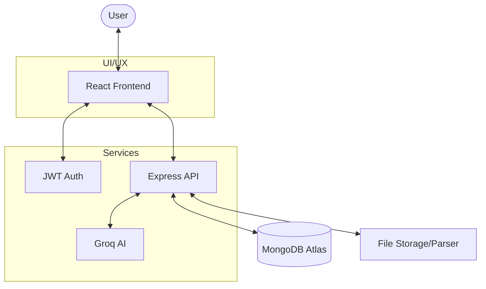

<div align="center">
  

  # 🚀 AI Resume Analyzer
  ### *Elevate Your Career with Groq Powered Insights*

  [](LICENSE)
  [](https://reactjs.org/)
  [](https://tailwindcss.com/)
  [](https://nodejs.org/)
  [](https://www.mongodb.com/)
  [](https://groq.com/)

  [**Explore the Code**](https://github.com/ananyaa241/Resume_Analyzer) • [**Report Bug**](https://github.com/ananyaa241/Resume_Analyzer/issues) • [**Request Feature**](https://github.com/ananyaa241/Resume_Analyzer/issues)
</div>

---

## 🌟 Overview

**AI Resume Analyzer** is a commercial-grade, full-stack web application designed to empower job seekers. By leveraging the advanced capabilities of **Groq**, it provides deep, actionable insights into how resumes perform against Applicant Tracking Systems (ATS).

Whether you're a recent graduate or a seasoned professional, our platform helps you bridge the gap between your experience and what recruiters are looking for.

## ✨ Key Features

- 🔐 **Secure Authentication**: Robust JWT-based registration and login system.
- 📄 **Multi-Format Support**: Seamlessly parse resumes in both **PDF** and **DOCX** formats.
- 🧠 **AI-Powered Analysis**: Detailed ATS match scores, keyword density analysis, and professional feedback via Groq API.
- 📊 **Interactive Data Visuals**: Stunning radar and circular charts powered by Recharts & Chart.js.
- 🛠️ **Instant Optimizer**: Real-time suggestions to enhance work experience, projects, and skills.
- 📜 **History & Tracking**: Manage and review your previous resume scans at any time.
- 🎨 **Premium UI/UX**: Modern glassmorphic design with full dark mode support and fluid animations using Framer Motion.

## 🛠️ Tech Stack

### Frontend
- **Framework**: `React.js` (Vite)
- **Styling**: `Tailwind CSS 4.0`
- **Animations**: `Framer Motion`
- **Charts**: `Recharts` & `Chart.js`
- **Icons**: `Lucide React`

### Backend
- **Runtime**: `Node.js`
- **Framework**: `Express.js`
- **Database**: `MongoDB Atlas` (via Mongoose)
- **AI Engine**: `Groq Llama 3` (via Groq API)
- **SDK**: `Groq SDK`
- **File Handling**: `Multer`, `pdf-parse`, `mammoth`

---

## 🏗️ System Architecture



---

## 🚀 Getting Started

### 📋 Prerequisites
- [Node.js](https://nodejs.org/) (v16.x or higher)
- [MongoDB Atlas](https://www.mongodb.com/cloud/atlas) account
- [Groq API Key](https://console.groq.com/keys)

### 🔧 Installation & Setup

1. **Clone the repository**
   ```bash
   git clone https://github.com/ananyaa241/Resume_Analyzer.git
   cd Resume_Analyzer
   ```

2. **Backend Configuration**
   ```bash
   cd backend
   npm install
   ```
   Create a `.env` file in the `backend` directory:
   ```env
   PORT=5000
   MONGODB_URI=your_mongodb_connection_string
   JWT_SECRET=your_jwt_secret_key
   GROQ_API_KEY=your_groq_api_key
   GROQ_MODEL=llama-3.3-70b-versatile
   ```
   Run the server:
   ```bash
   npm start
   ```

3. **Frontend Configuration**
   ```bash
   cd ../frontend
   npm install
   ```
   Create a `.env` file in the `frontend` directory:
   ```env
   VITE_API_URL=http://localhost:5000/api
   ```
   Launch the development server:
   ```bash
   npm run dev
   ```

---

## 🗺️ Roadmap
- [ ] Multi-language resume support.
- [ ] Integration with LinkedIn API for profile importing.
- [ ] Auto-generation of cover letters based on resume analysis.
- [ ] Real-time collaboration features.

## 🤝 Contributing
Contributions are what make the open-source community such an amazing place to learn, inspire, and create. Any contributions you make are **greatly appreciated**.

1. Fork the Project
2. Create your Feature Branch (`git checkout -b feature/AmazingFeature`)
3. Commit your Changes (`git commit -m 'Add some AmazingFeature'`)
4. Push to the Branch (`git push origin feature/AmazingFeature`)
5. Open a Pull Request

---

## 📄 License
Distributed under the MIT License. See `LICENSE` for more information.

<div align="center">
  Built by [Sai Ananya](https://github.com/ananyaa241)
</div>
